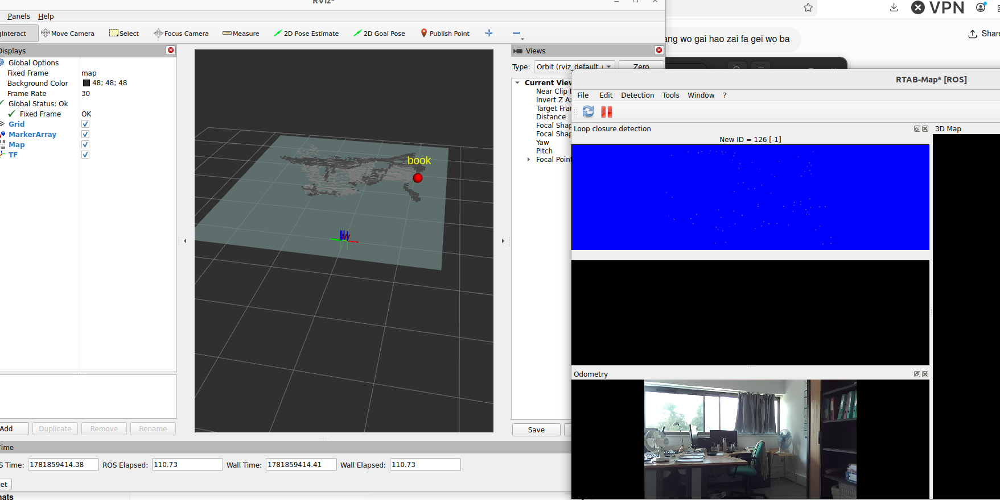
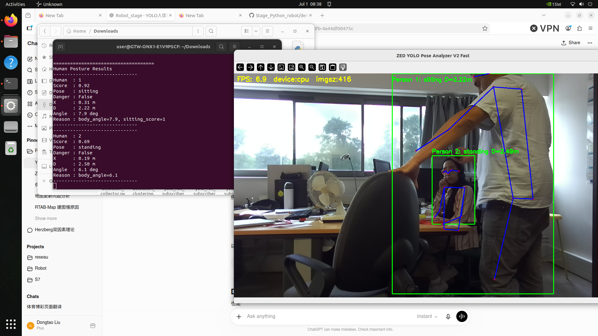
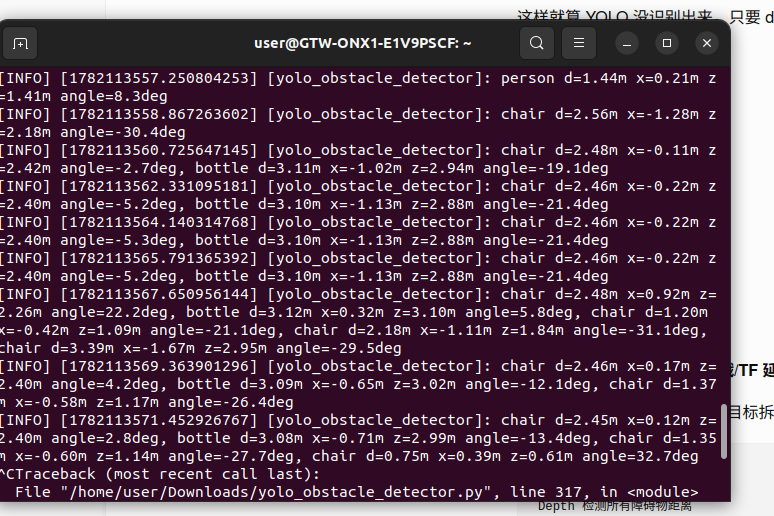

# Stage_Python_robot

Projet de stage ESIGELEC visant à développer une plateforme d’apprentissage et d’expérimentation en intelligence artificielle, Python et robotique autonome.

## document lien https://www.stereolabs.com/docs/embedded/zed-box
## demo lien https://github.com/stereolabs/zed-sdk/tree/master
## SDK download: https://www.stereolabs.com/en-fr/developers/release
## YOLO document:https://docs.ultralytics.com/#where-to-start
## YOLO-ZED:https://github.com/stereolabs/zed-yolo

# Stage_Python_robot

> **ESIGELEC Internship Project**  
> An educational robotics platform integrating **ZED2i**, **ROS2**, **RTAB-Map**, **YOLO11**, and **AI** for autonomous robot perception.

---

# Table of Contents

- Project Overview
- Project Objectives
- Hardware Platform
- Software Environment
- System Architecture
- Installation
- GPU Configuration
- ROS2 Integration
- RTAB-Map SLAM
- YOLO11 Detection
- Launch Instructions
- ROS2 Topics
- Applications
- Performance
- Troubleshooting
- Future Work
- References

---

# Project Overview

Stage_Python_robot is an internship project developed at ESIGELEC.

The objective is to build a modular robotic perception platform based on:

- ZED2i Stereo Camera
- NVIDIA Jetson Orin NX
- ROS2 Humble
- RTAB-Map SLAM
- YOLO11 Object Detection
- Human Pose Estimation

The project is intended for education, experimentation, and future autonomous navigation research.

---

# Project Objectives

- Learn Python for robotics
- Learn Artificial Intelligence algorithms
- Build a reusable robotics platform
- Detecte object or pose of human or emotion of human
- Integrate computer vision with ROS2
- Develop semantic mapping capabilities
- Prepare for autonomous navigation

---


---

# Hardware Platform

## Embedded Platform

- NVIDIA Jetson Orin NX
- ARM64 (aarch64)
- Ubuntu 22.04 LTS
- JetPack 6.0
- CUDA 12.2

## Camera

- Stereolabs ZED2i
- Stereo RGB Camera
- Depth Camera
- Visual Odometry
- IMU

## Default Login

Username

```text
user
```

Password

```text
admin
```

---
## Usage

### 1. Obstacle Detection with ZED Camera

Run:

```bash
python yolo_zed_obstacle.py
```

This script detects the **three closest obstacles** using the ZED camera and the YOLO object detector.

---

### 2. Human Pose Estimation

Run:

```bash
python zed_yolo_pose_v2_fast.py
```

This script performs **real-time human pose estimation** using the ZED camera.

---

### 3. Mapping YOLO Detections to RTAB-Map

Run:

```bash
python python_tensorrt_yolo_onnx_native/yolo_ros_subscriber_final.py
```

This script subscribes to the YOLO detection results and **projects the detected obstacles directly onto the RTAB-Map**, allowing the detected objects to be visualized in the generated map.

---

### 4. Emotion Recognition

The `emotion-recognition` module is used to perform **real-time human emotion recognition**.

Please refer to the documentation inside the `emotion-recognition` directory for setup and execution instructions.
# Software Environment

| Component | Version |
|------------|---------|
| Ubuntu | 22.04 |
| ROS2 | Humble |
| JetPack | 6.0 |
| CUDA | 12.2 |
| Python | 3.10 |
| ZED SDK | 4.2.x |
| OpenCV | Installed |
| PyTorch | Jetson Version |
| Ultralytics | YOLO11 |

---
To enable GPU acceleration, install the NVIDIA PyTorch wheels that match **JetPack 6.0 (L4T R36.2 / R36.3) + CUDA 12.2**.

Official NVIDIA installation page:

https://forums.developer.nvidia.com/t/pytorch-for-jetson/72048

Download the following packages:

- **torch 2.3**
  - `torch-2.3.0-cp310-cp310-linux_aarch64.whl`
- **torchvision 0.18**
  - `torchvision-0.18.0a0+6043bc2-cp310-cp310-linux_aarch64.whl`
- *(Optional)* **torchaudio 2.3**
  - `torchaudio-2.3.0+952ea74-cp310-cp310-linux_aarch64.whl`

Install them:

```bash
pip3 install torch-2.3.0-cp310-cp310-linux_aarch64.whl
pip3 install torchvision-0.18.0a0+6043bc2-cp310-cp310-linux_aarch64.whl --no-deps
pip3 install torchaudio-2.3.0+952ea74-cp310-cp310-linux_aarch64.whl --no-deps
```

Verify the installation:

```bash
python3 -c "import torch; print(torch.__version__); print(torch.cuda.is_available())"
```

Expected output:

```text
2.3.0
True
```

If `torch.cuda.is_available()` returns `False`, the model will run on the CPU instead of the NVIDIA GPU, resulting in significantly lower inference performance.
# System Architecture

```text
                    ZED2i Camera
                         │
              RGB Image + Depth Image
                         │
                     ZED SDK
                         │
          ┌──────────────┴──────────────┐
          │                             │
      RTAB-Map                     YOLO11
          │                             │
      2D / 3D Map               Object Detection
          │                             │
          └────────────TF───────────────┘
                         │
                 Semantic Mapping
                         │
                       RViz2
                         │
                 Autonomous Robot
```

---

# Installation

## Install ROS2

```bash
sudo apt update
sudo apt install ros-humble-desktop
```

## Create Workspace

```bash
mkdir -p ~/ros2_ws/src
cd ~/ros2_ws/src
```

## Clone ZED Wrapper

```bash
git clone https://github.com/stereolabs/zed-ros2-wrapper.git
```

```bash
cd zed-ros2-wrapper
git checkout humble-v4.2.5
```

## Build

```bash
cd ~/ros2_ws

source /opt/ros/humble/setup.bash

rosdep install --from-paths src --ignore-src -r -y

colcon build --symlink-install --cmake-args=-DCMAKE_BUILD_TYPE=Release
```

---

# GPU Configuration

Pipeline

```text
ZED2i
   │
RGB Image
   │
PyTorch
   │
CUDA 12.2
   │
Jetson GPU
   │
YOLO11
```

Check CUDA

```bash
python3 -c "import torch;print(torch.cuda.is_available())"
```

Expected

```text
True
```

---

# ROS2 Integration

Modules

- ZED ROS2 Wrapper
- RTAB-Map
- RViz2
- TF
- YOLO ROS Node

Data Flow

```text
Camera
 ↓
ROS2 Topics
 ↓
YOLO
 ↓
Markers
 ↓
RViz
```

---

# RTAB-Map

RTAB-Map is responsible for

- Loop Closure
- Occupancy Grid
- Point Cloud Mapping

Launch

```bash
ros2 launch rtabmap_launch rtabmap.launch.py \
rgb_topic:=/zed/zed_node/rgb/image_rect_color \
depth_topic:=/zed/zed_node/depth/depth_registered \
camera_info_topic:=/zed/zed_node/rgb/camera_info \
odom_topic:=/zed/zed_node/odom \
frame_id:=zed_camera_link \
approx_sync:=true \
subscribe_odom_info:=false
```

---

# YOLO11 Detection

Current implementation

- Object Detection
- Human Detection
- Pose Estimation
- Distance Estimation (with ZED depth)

Pipeline

```text
RGB Image
 ↓
YOLO11
 ↓
Bounding Boxes
 ↓
Depth Query
 ↓
3D Position
```

---

# Launch Instructions RTAB-map + yolo11n  

## Terminal 1

```bash
source /opt/ros/humble/setup.bash
source ~/ros2_ws/install/setup.bash

ros2 launch zed_wrapper zed_camera.launch.py \
  camera_model:=zed2i \
  publish_tf:=true \
  publish_map_tf:=true
```

---

## Terminal 2

```bash
ros2 launch rtabmap_launch rtabmap.launch.py \
  rgb_topic:=/zed/zed_node/rgb/image_rect_color \
  depth_topic:=/zed/zed_node/depth/depth_registered \
  camera_info_topic:=/zed/zed_node/rgb/camera_info \
  odom_topic:=/zed/zed_node/odom \
  visual_odometry:=false \
  subscribe_odom_info:=false \
  frame_id:=zed_camera_link \
  odom_frame_id:=odom \
  approx_sync:=true \
  approx_sync_max_interval:=0.2 \
  topic_queue_size:=30 \
  sync_queue_size:=30 \
  qos:=2 \
  Grid/3D:=false \
  rtabmap_args:="--delete_db_on_start" \
  rviz:=false \
  rtabmap_viz:=true
```

---

## Terminal 3

```bash
source /opt/ros/humble/setup.bash
source ~/ros2_ws/install/setup.bash

python3 ~/Downloads/yolo_semantic_dbscan_ttl_fixed.py \
  --model yolo11s.pt \
  --conf 0.25 \
  --dbscan_eps 0.6 \
  --dbscan_min_samples 2 \
  --point_ttl 5.0 \
  --publish_rate 2.0 \
  --image_topic /zed/zed_node/rgb/image_rect_color \
  --depth_topic /zed/zed_node/depth/depth_registered \
  --camera_info_topic /zed/zed_node/rgb/camera_info \
  --marker_topic /semantic/markers \
  --frame_id map \
  --camera_frame zed_left_camera_optical_frame
```

---

## Terminal 4

```bash
rviz2
```


## yolo+RTABmap 


```bash
python3 yolo_zed_obstacle.py
python3 zed_yolo_pose_v2_fast.py
```
The detected data will be printed in the terminal.





---

# ROS2 Topics

| Topic | Description |
|--------|-------------|
| /zed/zed_node/rgb/image_rect_color | RGB Image |
| /zed/zed_node/depth/depth_registered | Depth Image |
| /zed/zed_node/odom | Visual Odometry |
| /tf | Coordinate Transform |
| /yolo/markers | MarkerArray |
| /rtabmap/cloud_map | Point Cloud |
| /rtabmap/grid_prob_map | Occupancy Grid |

---

# Applications

- Object Detection
- Human Pose Estimation
- Semantic Mapping
- Visual SLAM
- Obstacle Detection
- Robot Localization

---

# Performance

Coming Soon

Future benchmarks

- FPS
- GPU Usage
- CPU Usage
- Memory Usage
- RTAB-Map Performance
- Detection Accuracy

---

# Troubleshooting

## torch.cuda.is_available() == False

Install the correct NVIDIA PyTorch wheel.

---

## Camera Stream Failed

- Close ZED Explorer
- Check USB connection
- Restart camera

---

## RTAB-Map does not update

Check

```bash
ros2 topic echo /zed/zed_node/odom
```

---

## Marker not displayed

Check

- TF
- RViz Fixed Frame
- Marker Topic

---

## GPU usage is 0%

The GPU is only used during neural network inference.
Idle periods are normal.

---

# Future Work

Completed

- ZED2i Integration
- ROS2 Communication
- RTAB-Map
- YOLO11 Detection
- Human Pose Estimation

Planned

- TensorRT Optimization
- Navigation2
- Obstacle Avoidance
- Face Recognition
- Facial Expression Recognition
- Human Following
- Voice Interaction

---

# References

- ZED SDK Documentation
- ZED ROS2 Wrapper
- RTAB-Map
- ROS2 Humble Documentation
- Ultralytics YOLO

# Real-Time Facial Expression Recognition

## Project Overview

This project implements a real-time facial expression recognition system
using a **ZED2i camera**, **OpenCV**, and a **pre-trained ResNet18 model
(FER-PyTorch)**.

## Workflow

``` text
ZED2i Camera
      ↓
Capture RGB Frame
      ↓
OpenCV Detects Face
      ↓
Crop Face ROI
      ↓
Resize & Preprocess
      ↓
FER-PyTorch (Pre-trained ResNet18)
      ↓
Predict Emotion
      ↓
Display Result
```

## Main Steps

1.  **Capture Image**\
    Acquire real-time RGB frames from the ZED2i camera.

2.  **Face Detection**\
    Detect the face using OpenCV and obtain the face location.

3.  **Face Extraction (ROI)**\
    Crop the detected face region and remove the background.

4.  **Emotion Recognition**\
    Feed the cropped face into the pre-trained ResNet18 model to
    classify one of the seven facial expressions.

5.  **Visualization**\
    Display the detected face together with the predicted emotion and
    confidence score in real time.

## Technologies

-   Camera: ZED2i
-   SDK: ZED SDK
-   Image Processing: OpenCV
-   Deep Learning: PyTorch
-   Emotion Model: FER-PyTorch (ResNet18)
-   Language: Python

