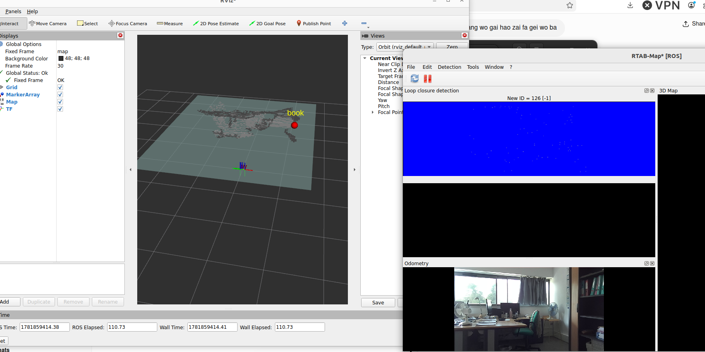
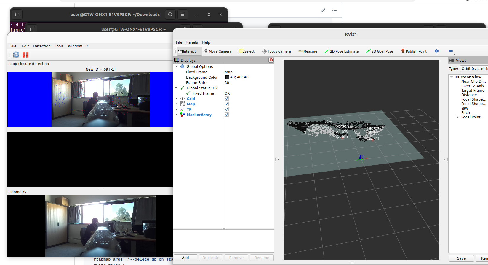
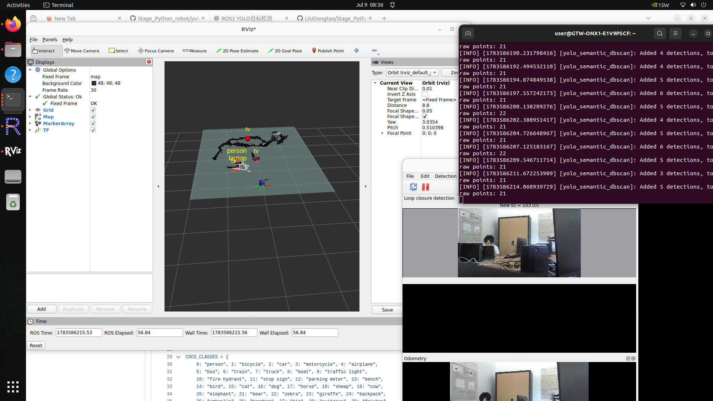
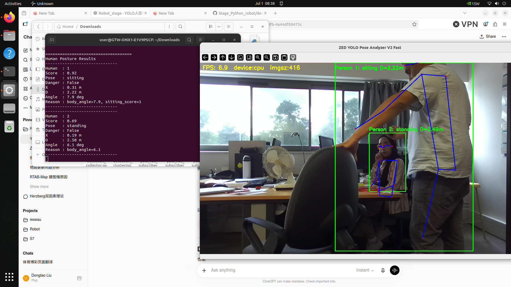
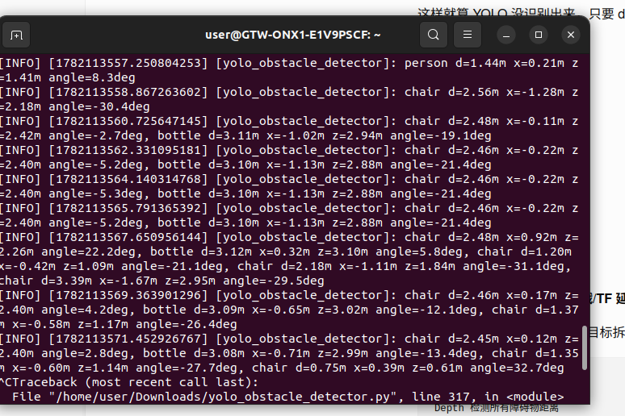

# Stage_Python_robot

Projet de stage ESIGELEC visant à développer une plateforme d’apprentissage et d’expérimentation en intelligence artificielle, Python et robotique autonome.

## document lien https://www.stereolabs.com/docs/embedded/zed-box
## demo lien https://github.com/stereolabs/zed-sdk/tree/master
## SDK download: https://www.stereolabs.com/en-fr/developers/release
## YOLO document:https://docs.ultralytics.com/#where-to-start
## YOLO-ZED:https://github.com/stereolabs/zed-yolo
## EMOTION model/dataset: https://www.kaggle.com/code/gauravdiwan/fer-model-pytorch


# Stage_Python_robot

> **ESIGELEC Internship Project**  
> An educational robotics platform integrating **ZED2i**, **ROS2**, **RTAB-Map**, **YOLO11**, and **AI** for autonomous robot perception.

---

# Table of Contents

- Project Overview
- Project Objectives
- Hardware Platform
- Software Environment
- System Architecture
- Installation
- GPU Configuration
- ROS2 Integration
- RTAB-Map SLAM
- YOLO11 Detection
- Launch Instructions
- ROS2 Topics
- Applications
- Performance
- Troubleshooting
- Future Work
- References

---

# Project Overview

Stage_Python_robot is an internship project developed at ESIGELEC.

The objective is to build a modular robotic perception platform based on:

- ZED2i Stereo Camera
- NVIDIA Jetson Orin NX
- ROS2 Humble
- RTAB-Map SLAM
- YOLO11 Object Detection
- Human Pose Estimation

The project is intended for education, experimentation, and future autonomous navigation research.

---

# Project Objectives

- Learn Python for robotics
- Learn Artificial Intelligence algorithms
- Build a reusable robotics platform
- Detecte object or pose of human or emotion of human
- Integrate computer vision with ROS2
- Develop semantic mapping capabilities
- Prepare for autonomous navigation

---


---

# Hardware Platform

## Embedded Platform

- NVIDIA Jetson Orin NX
- ARM64 (aarch64)
- Ubuntu 22.04 LTS
- JetPack 6.0
- CUDA 12.2

## Camera

- Stereolabs ZED2i
- Stereo RGB Camera
- Depth Camera
- Visual Odometry
- IMU

## Default Login

Username

```text
user
```

Password

```text
admin
```

---
## 5 useful Usage 

### 1. Obstacle Detection with ZED Camera

Run:

```bash
python yolo_zed_obstacle.py
```

This script detects the **three closest obstacles** using the ZED camera and the YOLO object detector.

---

### 2. Human Pose Estimation zed_yolo_pose_v2_fast.py

Run:

```bash
python zed_yolo_pose_v2_fast.py
```

This script performs **real-time human pose estimation** using the ZED camera.

---

### 3. Mapping YOLO Detections to RTAB-Map yolortab3obstacle.py(ajoute 3obstacles plus proche de caméra dans la carte )yolo_semantic_dbscan_ttl_latest_tf_fixed.py(afficher tous les obstacles dans la carte)

Run:

```bash
python3 yolortab3obstacle.py
```
or 
```bash
python3 yolo_semantic_dbscan_ttl_latest_tf_fixed.py
```

This script subscribes to the YOLO detection results and **projects the detected obstacles directly onto the RTAB-Map**, allowing the detected objects to be visualized in the generated map.
for more infomation and step they are under
---

### 4. Emotion Recognition

The `emotion-recognition` module is used to perform **real-time human emotion recognition**.

Please refer to the documentation inside the `emotion-recognition` directory for setup and execution instructions.


### 5. detecte all the objects and show them on the screen  yolo_ros_subscriber_final.py
dans le dossier python_tensorrt_yolo_onnx_native


# Software Environment

| Component | Version |
|------------|---------|
| Ubuntu | 22.04 |
| ROS2 | Humble |
| JetPack | 6.0 |
| CUDA | 12.2 |
| Python | 3.10 |
| ZED SDK | 4.2.x |
| OpenCV | Installed |
| PyTorch | Jetson Version |
| Ultralytics | YOLO11 |

---
** C'est un rare problème mais si le premier fois de utiliser le StereoLabs mais il y a aucune commande fonction par exemple**
```bash
bash:commande not found
```
Vous pouvez essayer d'utiliser les codes suivantes pour quand on ouvrir chaque premier terminal:
```bash
export PATH=/usr/local/sbin:/usr/local/bin:/usr/sbin:/usr/bin:/sbin:/bin
```


--------------------------------------------------------------------------------------------------------------------------------------------------------------------------------------------------------------
To enable GPU acceleration, install the NVIDIA PyTorch wheels that match **JetPack 6.0 (L4T R36.2 / R36.3) + CUDA 12.2**.

**Il faut tout d'abord  téléchargé les zips sur le lien de NVIDIA suivante et dans le ~/home/user/ et fonction les code suivantes directement pour obtenir le torch**

Official NVIDIA installation page:

https://forums.developer.nvidia.com/t/pytorch-for-jetson/72048

Download the following packages:

- **torch 2.3**
  - `torch-2.3.0-cp310-cp310-linux_aarch64.whl`
- **torchvision 0.18**
  - `torchvision-0.18.0a0+6043bc2-cp310-cp310-linux_aarch64.whl`
- *(Optional)* **torchaudio 2.3**
  - `torchaudio-2.3.0+952ea74-cp310-cp310-linux_aarch64.whl`

Install them:

```bash
pip3 install torch-2.3.0-cp310-cp310-linux_aarch64.whl
pip3 install torchvision-0.18.0a0+6043bc2-cp310-cp310-linux_aarch64.whl --no-deps
pip3 install torchaudio-2.3.0+952ea74-cp310-cp310-linux_aarch64.whl --no-deps
```

Verify the installation:

```bash
python3 -c "import torch; print(torch.__version__); print(torch.cuda.is_available())"
```

Expected output:

```text
2.3.0
True
```

If `torch.cuda.is_available()` returns `False`, the model will run on the CPU instead of the NVIDIA GPU, resulting in significantly lower inference performance.
# System Architecture

```text
                    ZED2i Camera
                         │
              RGB Image + Depth Image
                         │
                     ZED SDK
                         │
          ┌──────────────┴──────────────┐
          │                             │
      RTAB-Map                     YOLO11
          │                             │
      2D / 3D Map               Object Detection
          │                             │
          └────────────TF───────────────┘
                         │
                 Semantic Mapping
                         │
                       RViz2
                         │
                 Autonomous Robot
```

---

# Installation
## Troubleshooting

### 1. ROS 2 Humble is not available

Check whether ROS 2 Humble is installed:

```bash
ls /opt/ros/
```

Then load the ROS 2 environment:

```bash
source /opt/ros/humble/setup.bash
```

Check the ROS distribution:

```bash
echo $ROS_DISTRO
```

Expected output:

```text
humble
```

If `/opt/ros/humble` does not exist, ROS 2 Humble is not correctly installed on the machine.

---

### 2. `www.ros.org` 404 error during `apt update`

Example error:

```text
The repository 'https://www.ros.org jammy Release' does not have a Release file.
404 Not Found
```

This means that an incorrect ROS APT repository has been configured.

Find the incorrect repository:

```bash
grep -Rni "www.ros.org" /etc/apt/ 2>/dev/null
```

Remove or disable the incorrect `www.ros.org` repository.

The ROS 2 repository should use:

```text
packages.ros.org/ros2/ubuntu
```

After correcting the repository:

```bash
sudo apt update
```

Make sure that the `www.ros.org` 404 error no longer appears.

---

### 3. `Unable to locate package ros-humble-...`

Example:

```text
E: Unable to locate package ros-humble-xacro
```

This usually means that the ROS 2 APT repository is missing or incorrectly configured.

First check:

```bash
sudo apt update
```

The output should contain the ROS 2 repository:

```text
packages.ros.org/ros2/ubuntu
```

Then check whether the package can be found:

```bash
apt-cache policy ros-humble-xacro
```

Once the ROS 2 repository is correctly configured, install the required package normally:

```bash
sudo apt install ros-humble-xacro
```

---

### 4. `xacro: command not found`

Example error:

```text
/bin/bash: xacro: command not found
```

Install the ROS 2 Humble xacro package:

```bash
sudo apt update
sudo apt install ros-humble-xacro
```

Then reload ROS 2:

```bash
source /opt/ros/humble/setup.bash
```

Verify:

```bash
which xacro
```

Expected result:

```text
/opt/ros/humble/bin/xacro
```

---

### 5. `rosdep installation has not been initialized`

Example error:

```text
ERROR: your rosdep installation has not been initialized yet.
```

Initialize rosdep:

```bash
sudo rosdep init
```

Then update the rosdep database:

```bash
rosdep update
```

> `rosdep update` should be executed without `sudo`.

After that, install the dependencies of the ROS 2 workspace:

```bash
cd ~/ros2_ws

source /opt/ros/humble/setup.bash

rosdep install --from-paths src --ignore-src -r -y
```

---

### 6. `zed_msgs` or `nmea_msgs` not found during build

Example:

```text
Could not find a package configuration file provided by "zed_msgs"
```

or:

```text
Could not find a package configuration file provided by "nmea_msgs"
```

Do not immediately modify `CMAKE_PREFIX_PATH` or `zed_msgs_DIR`.

First make sure that `rosdep` has been initialized and that all dependencies have been installed:

```bash
sudo rosdep init
rosdep update
```

If `rosdep init` was already executed previously, only run:

```bash
rosdep update
```

Then:

```bash
cd ~/ros2_ws
source /opt/ros/humble/setup.bash

rosdep install --from-paths src --ignore-src -r -y
```

The dependency installation should finish successfully before building the workspace.

If necessary, clean the previous failed build:

```bash
cd ~/ros2_ws
rm -rf build install log
```

Then rebuild:

```bash
colcon build --symlink-install --cmake-args=-DCMAKE_BUILD_TYPE=Release
```

A successful ZED ROS 2 Wrapper build should end with something similar to:

```text
Finished <<< zed_components
Finished <<< zed_wrapper
Finished <<< zed_ros2

Summary: 3 packages finished
```

---

### 7. ZED packages are not visible after a successful build

After a successful `colcon build`, the workspace must be sourced:

```bash
source /opt/ros/humble/setup.bash
source ~/ros2_ws/install/setup.bash
```

Then check:

```bash
ros2 pkg list | grep zed
```

The ZED packages should now be visible.

Every new terminal requires these commands unless they are added to `~/.bashrc`:

```bash
echo "source /opt/ros/humble/setup.bash" >> ~/.bashrc
echo "source ~/ros2_ws/install/setup.bash" >> ~/.bashrc
source ~/.bashrc
```
## Complete ROS 2 Humble Installation

> This section is for Ubuntu 22.04 (Jammy), including ARM64 Jetson/ZED Box systems.

### 1. Check Ubuntu version

```bash
lsb_release -a
```

Expected:

```text
Release: 22.04
Codename: jammy
```

---

### 2. Configure locale

```bash
sudo apt update
sudo apt install locales -y

sudo locale-gen en_US en_US.UTF-8
sudo update-locale LC_ALL=en_US.UTF-8 LANG=en_US.UTF-8

export LANG=en_US.UTF-8
```

Check:

```bash
locale
```

---

### 3. Enable Ubuntu Universe repository

```bash
sudo apt install software-properties-common -y
sudo add-apt-repository universe
```

---

### 4. Install required tools

```bash
sudo apt update
sudo apt install curl -y
```

---

### 5. Add the ROS 2 repository key

```bash
sudo curl -sSL \
https://raw.githubusercontent.com/ros/rosdistro/master/ros.key \
-o /usr/share/keyrings/ros-archive-keyring.gpg
```

---

### 6. Add the official ROS 2 repository

```bash
echo "deb [arch=$(dpkg --print-architecture) signed-by=/usr/share/keyrings/ros-archive-keyring.gpg] http://packages.ros.org/ros2/ubuntu $(. /etc/os-release && echo $UBUNTU_CODENAME) main" \
| sudo tee /etc/apt/sources.list.d/ros2.list > /dev/null
```

Update APT:

```bash
sudo apt update
```

The ROS repository should appear as:

```text
packages.ros.org/ros2/ubuntu
```

Do NOT use:

```text
www.ros.org
```

as an APT repository.

---

### 7. Install ROS 2 Humble Desktop

```bash
sudo apt install ros-humble-desktop -y
```

Install ROS development tools:

```bash
sudo apt install ros-dev-tools -y
```

---

### 8. Load the ROS 2 environment

```bash
source /opt/ros/humble/setup.bash
```

Verify:

```bash
echo $ROS_DISTRO
```

Expected:

```text
humble
```

Also check:

```bash
ros2 --help
```

---

### 9. Initialize rosdep

```bash
sudo rosdep init
```

Then:

```bash
rosdep update
```

If `rosdep init` reports that the sources list already exists, do not initialize it again. Run only:

```bash
rosdep update
```

---

### 10. Optional: automatically source ROS 2

To avoid running the source command every time a new terminal is opened:

```bash
echo "source /opt/ros/humble/setup.bash" >> ~/.bashrc
source ~/.bashrc
```

Check:

```bash
echo $ROS_DISTRO
```

Expected:

```text
humble
```

---

## ZED ROS 2 Workspace

After ROS 2 Humble is installed, create the workspace:

```bash
mkdir -p ~/ros2_ws/src
cd ~/ros2_ws/src
```

Clone the ZED ROS 2 Wrapper:

```bash
git clone --recursive https://github.com/stereolabs/zed-ros2-wrapper.git
```

Enter the repository:

```bash
cd zed-ros2-wrapper
```

For this project:

```bash
git checkout humble-v4.2.5
git submodule update --init --recursive
```

Install ROS dependencies:

```bash
cd ~/ros2_ws

source /opt/ros/humble/setup.bash

rosdep update

rosdep install --from-paths src --ignore-src -r -y
```

Build:

```bash
colcon build --symlink-install --cmake-args=-DCMAKE_BUILD_TYPE=Release
```

Load the workspace:

```bash
source ~/ros2_ws/install/setup.bash
```

Check the ZED packages:

```bash
ros2 pkg list | grep zed
```

---

## Automatically load ROS 2 + ZED workspace

After the workspace has been successfully built:

```bash
echo "source /opt/ros/humble/setup.bash" >> ~/.bashrc
echo "source ~/ros2_ws/install/setup.bash" >> ~/.bashrc
```

Reload:

```bash
source ~/.bashrc
```

From now on, new terminals should automatically load both ROS 2 Humble and the ZED ROS 2 workspace.
---

# GPU Configuration

Pipeline

```text
ZED2i
   │
RGB Image
   │
PyTorch
   │
CUDA 12.2
   │
Jetson GPU
   │
YOLO11
```

Check CUDA

```bash
python3 -c "import torch;print(torch.cuda.is_available())"
```

Expected

```text
True
```

---

# ROS2 Integration

Modules

- ZED ROS2 Wrapper
- RTAB-Map
- RViz2
- TF
- YOLO ROS Node

Data Flow

```text
Camera
 ↓
ROS2 Topics
 ↓
YOLO
 ↓
Markers
 ↓
RViz
```

---

# RTAB-Map

RTAB-Map is responsible for

- Loop Closure
- Occupancy Grid
- Point Cloud Mapping

Launch

```bash
ros2 launch rtabmap_launch rtabmap.launch.py \
rgb_topic:=/zed/zed_node/rgb/image_rect_color \
depth_topic:=/zed/zed_node/depth/depth_registered \
camera_info_topic:=/zed/zed_node/rgb/camera_info \
odom_topic:=/zed/zed_node/odom \
frame_id:=zed_camera_link \
approx_sync:=true \
subscribe_odom_info:=false
```

---

# YOLO11 Detection

Current implementation

- Object Detection
- Human Detection
- Pose Estimation
- Distance Estimation (with ZED depth)

Pipeline

```text
RGB Image
 ↓
YOLO11
 ↓
Bounding Boxes
 ↓
Depth Query
 ↓
3D Position
```

---

# Launch Instructions RTAB-map + yolo11n  (Fait attention chaque terminal il faut on code les source pour tout d'abord complier,et après )


## Terminal 1

```bash
source /opt/ros/humble/setup.bash
source ~/ros2_ws/install/setup.bash

ros2 launch zed_wrapper zed_camera.launch.py \
  camera_model:=zed2i \
  publish_tf:=true \
  publish_map_tf:=true
```

---

## Terminal 2  

```bash
source /opt/ros/humble/setup.bash
source ~/ros2_ws/install/setup.bash
ros2 launch rtabmap_launch rtabmap.launch.py \
  rgb_topic:=/zed/zed_node/rgb/image_rect_color \
  depth_topic:=/zed/zed_node/depth/depth_registered \
  camera_info_topic:=/zed/zed_node/rgb/camera_info \
  odom_topic:=/zed/zed_node/odom \
  visual_odometry:=false \
  subscribe_odom_info:=false \
  frame_id:=zed_camera_link \
  odom_frame_id:=odom \
  approx_sync:=true \
  approx_sync_max_interval:=0.2 \
  topic_queue_size:=30 \
  sync_queue_size:=30 \
  qos:=2 \
  Grid/3D:=false \
  rtabmap_args:="--delete_db_on_start" \
  rviz:=false \
  rtabmap_viz:=true
```

---

## Terminal 3  yolo_semantic_dbscan_ttl_latest_tf_fixed.py  or yolortab3obstacle.py

```bash
source /opt/ros/humble/setup.bash
source ~/ros2_ws/install/setup.bash

python3 ~/Downloads/yolo_semantic_dbscan_ttl_latest_tf_fixed.py \
  --model yolo11s.pt \
  --conf 0.25 \
  --dbscan_eps 0.6 \
  --dbscan_min_samples 2 \
  --point_ttl 5.0 \
  --publish_rate 2.0 \
  --image_topic /zed/zed_node/rgb/image_rect_color \
  --depth_topic /zed/zed_node/depth/depth_registered \
  --camera_info_topic /zed/zed_node/rgb/camera_info \
  --marker_topic /semantic/markers \
  --frame_id map \
  --camera_frame zed_left_camera_optical_frame
```
or

```bash
python3 yolortab3obstacle.py
```

---

## Terminal 4

```bash
rviz2
```


## yolo+RTABmap 




```bash
python3 yolo_zed_obstacle.py
python3 zed_yolo_pose_v2_fast.py
```
The detected data will be printed in the terminal.





---

# ROS2 Topics

| Topic | Description |
|--------|-------------|
| /zed/zed_node/rgb/image_rect_color | RGB Image |
| /zed/zed_node/depth/depth_registered | Depth Image |
| /zed/zed_node/odom | Visual Odometry |
| /tf | Coordinate Transform |
| /yolo/markers | MarkerArray |
| /rtabmap/cloud_map | Point Cloud |
| /rtabmap/grid_prob_map | Occupancy Grid |

---

# Applications

- Object Detection
- Human Pose Estimation
- Semantic Mapping
- Visual SLAM
- Obstacle Detection
- Robot Localization

---

# Performance

Coming Soon

Future benchmarks

- FPS
- GPU Usage
- CPU Usage
- Memory Usage
- RTAB-Map Performance
- Detection Accuracy

---

# Troubleshooting

## torch.cuda.is_available() == False

Install the correct NVIDIA PyTorch wheel.

---

## Camera Stream Failed

- Close ZED Explorer
- Check USB connection
- Restart camera

---

## RTAB-Map does not update

Check

```bash
ros2 topic echo /zed/zed_node/odom
```

---

## Marker not displayed

Check

- TF
- RViz Fixed Frame
- Marker Topic

---

## GPU usage is 0%

The GPU is only used during neural network inference.
Idle periods are normal.

---

# Future Work

Completed

- ZED2i Integration
- ROS2 Communication
- RTAB-Map
- YOLO11 Detection
- Human Pose Estimation

Planned

- TensorRT Optimization
- Navigation2
- Obstacle Avoidance
- Face Recognition
- Facial Expression Recognition
- Human Following
- Voice Interaction

---

# References

- ZED SDK Documentation
- ZED ROS2 Wrapper
- RTAB-Map
- ROS2 Humble Documentation
- Ultralytics YOLO

# Real-Time Facial Expression Recognition

## Project Overview

This project implements a real-time facial expression recognition system
using a **ZED2i camera**, **OpenCV**, and a **pre-trained ResNet18 model
(FER-PyTorch)**.

## Workflow

``` text
ZED2i Camera
      ↓
Capture RGB Frame
      ↓
OpenCV Detects Face
      ↓
Crop Face ROI
      ↓
Resize & Preprocess
      ↓
FER-PyTorch (Pre-trained ResNet18)
      ↓
Predict Emotion
      ↓
Display Result
```

## Main Steps

1.  **Capture Image**\
    Acquire real-time RGB frames from the ZED2i camera.

2.  **Face Detection**\
    Detect the face using OpenCV and obtain the face location.

3.  **Face Extraction (ROI)**\
    Crop the detected face region and remove the background.

4.  **Emotion Recognition**\
    Feed the cropped face into the pre-trained ResNet18 model to
    classify one of the seven facial expressions.

5.  **Visualization**\
    Display the detected face together with the predicted emotion and
    confidence score in real time.

## Technologies

-   Camera: ZED2i
-   SDK: ZED SDK
-   Image Processing: OpenCV
-   Deep Learning: PyTorch
-   Emotion Model: FER-PyTorch (ResNet18)
-   Language: Python

