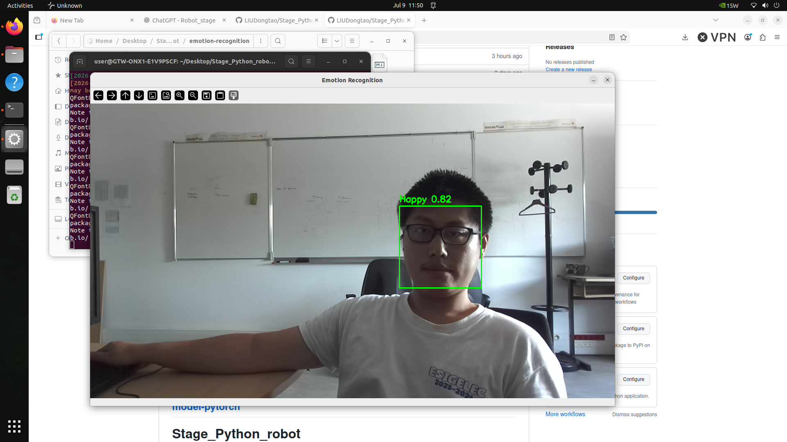
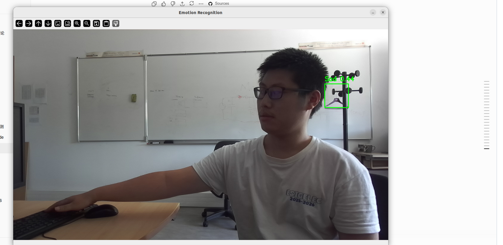

# Project Emotion Structure

This project is organized into multiple modules to improve readability, maintainability, and future scalability.

```
emotion-recognition/
│
├── camera/
├── detector/
├── emotion/
├── models/
├── utils/
└── main.py
```

---

## camera/

This folder is responsible for camera operations.

**File**

- `zed_camera.py`

**Function**

- Initialize the ZED2i camera
- Capture real-time RGB images
- Return image frames to the main program

---

## detector/

This folder performs face detection.

**File**

- `face_detector.py`

**Function**

- Detect faces using OpenCV
- Return the face bounding box coordinates `(x, y, w, h)`
- Support multiple face detection

---

## emotion/

This folder is responsible for facial expression recognition.

**Files**

- `emotion_model.py`
- `labels.py`

**Function**

- Load the pre-trained FER-PyTorch (ResNet18) model
- Preprocess the detected face image


Supported emotions:

- Angry
- Disgust
- Fear
- Happy
- Sad
- Surprise
- Neutral

---

## models/

This folder stores trained model weights.

**Example**

```
emotion_model.pth
```

The model is loaded during runtime for real-time emotion prediction.

---

## example
# good:


# bad:

---


---

# Overall Workflow

```
ZED2i Camera
      │
      ▼
Capture RGB Image
      │
      ▼
Face Detection
      │
      ▼
Crop Face ROI
      │
      ▼
Emotion Recognition
      │
      ▼
Display Emotion
```
